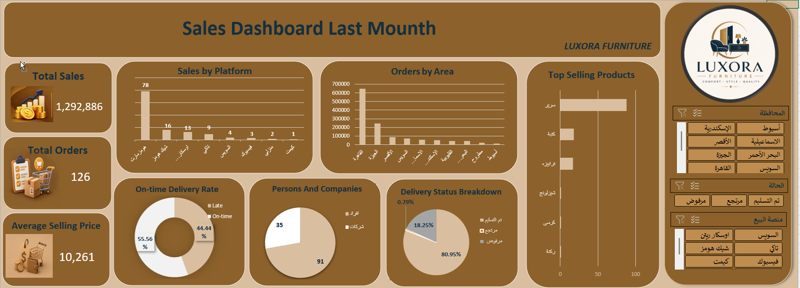

# Furniture Sales Analysis Dashboard

## 📊 Project Overview

An interactive sales analysis dashboard built using Microsoft Excel to analyze the performance of a furniture store.

The project focuses on transforming sales data into meaningful business insights using data cleaning, Pivot Tables, Pivot Charts, and interactive Slicers.

## 🛠️ Tools & Skills

- Microsoft Excel
- Data Cleaning
- Pivot Tables
- Pivot Charts
- Slicers
- Data Analysis
- Business Insights

## 📌 Dashboard Features

- Total Sales
- Total Orders
- Average Selling Price
- Sales by Platform
- Orders by Area
- Top Selling Products
- On-time Delivery Rate
- Customer Type Analysis
- Delivery Status Breakdown

## 💡 Key Insights

- The top-performing sales platform generated the highest number of orders.
- Cairo recorded the highest number of orders among the analyzed areas.
- Beds were the top-selling product.
- 44.44% of orders were delivered on time.
- Individual customers represented the majority of orders.

## 🎯 Recommendations

- Investigate the main causes of delivery delays and improve the delivery process.
- Focus marketing efforts on high-performing sales platforms.
- Ensure sufficient stock for top-selling products.
- Analyze the reasons behind rejected orders.
- Investigate lower-performing areas to identify opportunities for growth.

## 📁 Project Files

- `Furniture Sales Analysis.xlsx` — Complete Excel dashboard and analysis.
- `README.md` — Project documentation.
## 📷 Dashboard Preview

